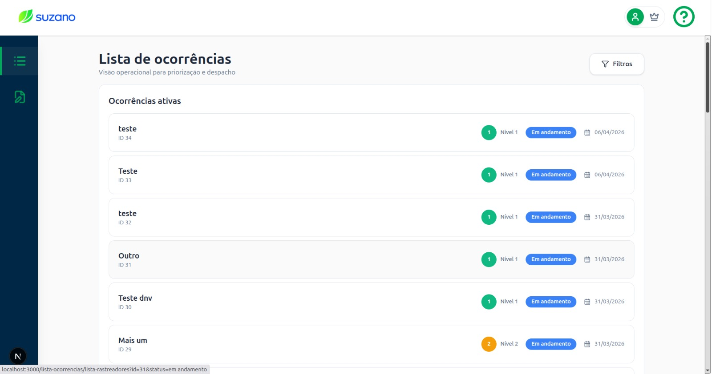

# Testes de Usabilidade

## 1. Tela analisada

Tela operacional que lista ocorrências de incêndio ativas e históricas. Exibe para cada item: título, ID, badge de gravidade colorida (níveis) e badge de status (em andamento / em pausa / resolvida).

---

## 2. Tipo de teste

**Visualização**

Será testado se as badges de gravidade (verde = nível 1, laranja = nível 2, vermelho = nível 3) comunicam urgência de forma intuitiva, e se a hierarquia visual da tela permite ao usuário identificar qual ocorrência exige ação imediata sem precisar ler todos os textos da interface.

---

## 3. Conjunto de perguntas (técnica do funil)

| # | Pergunta | Tipo |
|---|----------|------|
| 1 | "Olhando para essa tela, o que você consegue entender sobre as ocorrências listadas? Me conta o que você vê." | Exploratória ampla |
| 2 | "O que esses indicadores coloridos ao lado de cada ocorrência representam para você?" | Open followup |
| 3 | "Apenas olhando os elementos visuais, sem ler todos os textos, você consegue perceber alguma diferença de urgência entre as ocorrências?" | Open followup |
| 4 | "Se você precisasse agir imediatamente em uma dessas ocorrências, qual você escolheria? Por quê?" | Fechada / direcionada |
| 5 | "O que 'Nível 1', 'Nível 2' e 'Nível 3' significam para você? A diferença de urgência entre eles fica clara visualmente?" | Específica |

---

## 4. Objetivo do teste

Verificar se as badges de gravidade (cores e níveis numéricos) comunicam urgência de forma intuitiva, e se a hierarquia visual da tela permite ao usuário identificar qual ocorrência exige ação prioritária sem necessidade de instrução adicional.

---

## 5. Ação ou entendimento esperado

O usuário deve conseguir identificar visualmente que vermelho/nível 3 representa a maior urgência, e apontar a ocorrência mais crítica com base nos elementos visuais, sem precisar de explicações sobre o sistema de cores ou níveis.
